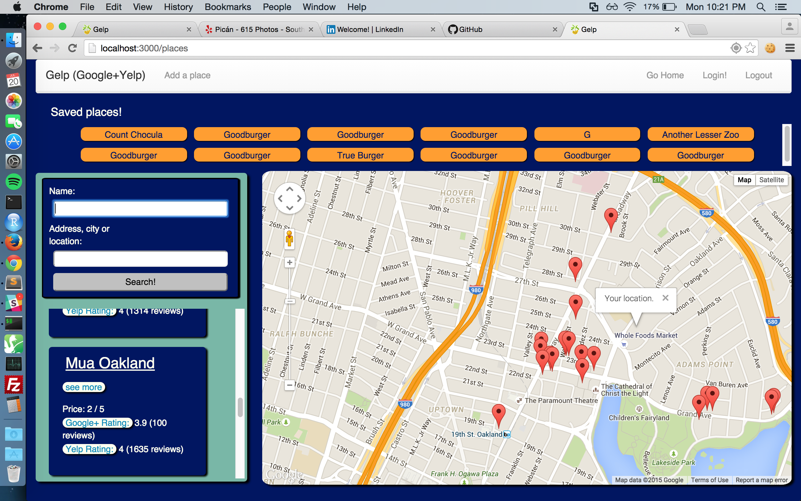
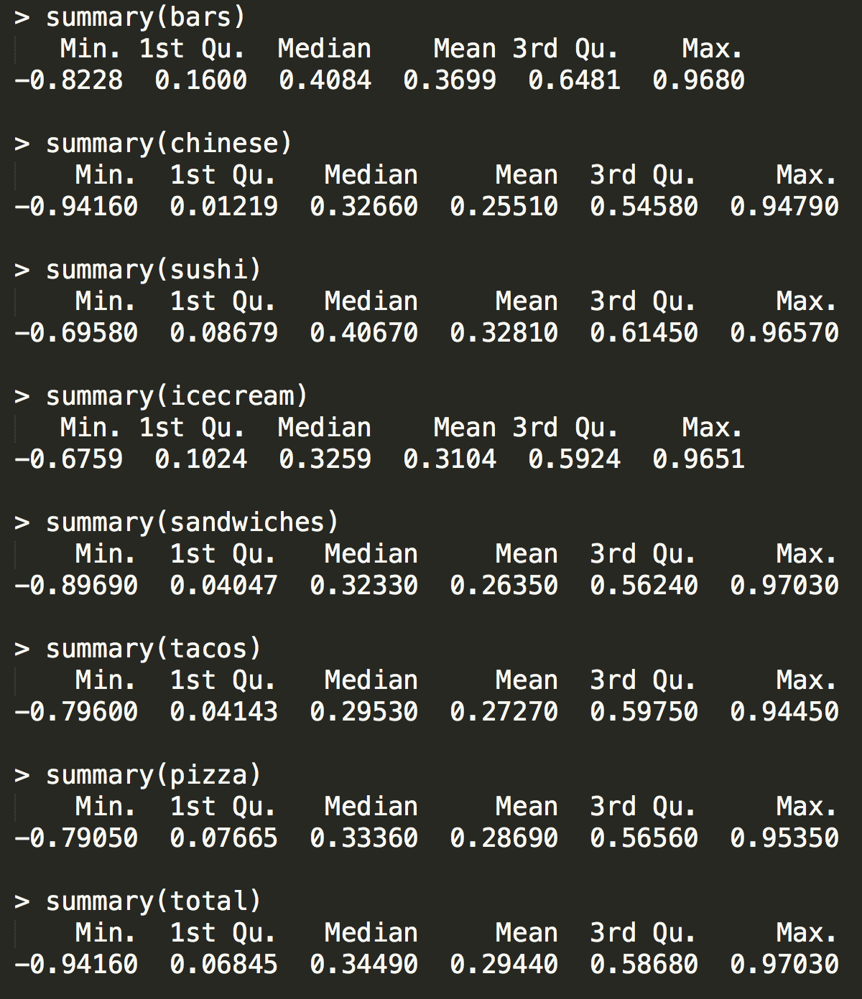
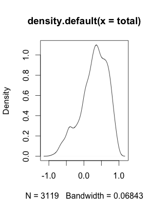
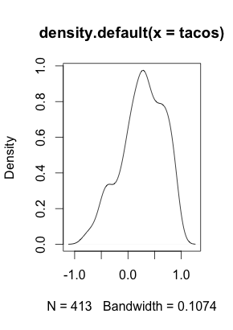
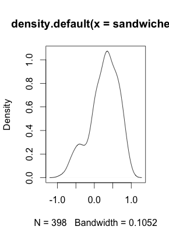
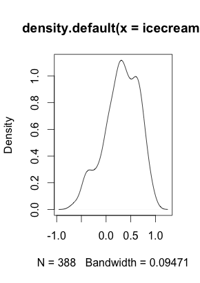
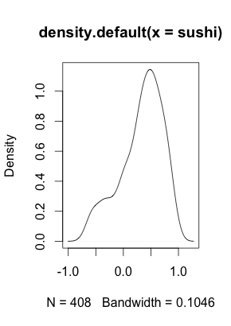
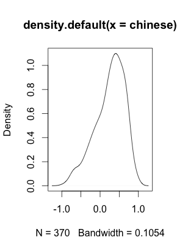
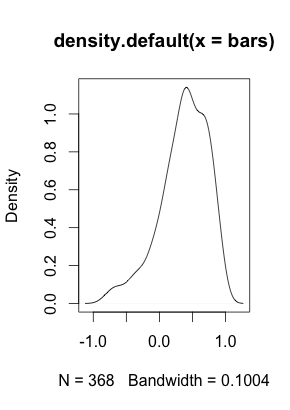

# Gelp (Google+Yelp) - playing with APIs and sentimentAnalysis

 [see this app in action!](https://gelp-plus.herokuapp.com/)

This Node.js app built with MongoDB allows users to compare both scores from Yelp and Google+ for a restaurant at the same time. It uses the Yelp, Google Maps and Alchemy Labs APIs, and dynamically scrapes text content of reviews to be scored with sentiment analysis to generate a third score. While the data pipeline for the third score is built, a dynamic third score of each location is not currently available because of API rate limitations. 

*The majority of this app was created in about the span of a week, during my 9th week of learning JavaScript. Currently, this project is being significantly expanded: with a larger dataset of Yelp reviews on which to more accurately scale the third score, improved UI, and a Django server to conduct the sentiment analysis in order to avoid API rate limitations.*

Relevant links:

Original repo: https://github.com/emoreno619/sentimentAnalysis
Expansion of this project: https://github.com/emoreno619/yelpData
My blog for further explanation: https://medium.com/@emoreno619

The third score is generated by feeding text of reviews that users have written on Yelp and Google+ to Alchemy Labs' Sentiment Analysis API to score each review, then the sum of those scores are scaled out of 5 to be easily compared with those of Yelp and Google+. The score is scaled out of 5 by collecting through scraping the text content of thousands of reviews for locations and calculating their sentiment; a quantile method then calculates the percentile distributions to determine which sentiment scores correlate with each rating out of 5.

This methodology is significant and different, because normally on Yelp and Google+, USERS give the score for a location, and the same score could have different meanings for different users. So, by using the same rubric or criteria of a computer program to assign scores based on the words for all users' reviews, hopefully the new, calculated scores can provide a more objective or accurate rating for a restaurant (though there are of course costs and limitations to this approach as well, hence my desire to display all three scores to empower users with more information).

Additionally, this app offers users access to full CRUD (the main purpose of the assignment) and can create accounts to add and save locations and write their own reviews of a location. These pages of the website aren't styled yet, but they all work. Additional features need to be added like a 'save' button in the search results that will automatically create and save that restaurant so that its info doesn't need to be typed in, a map for each restaurant's individual page, Oauth support via passport etc.

##Going Forward

I need more data to ensure a representative third scale. Moreover, I plan to conduct some more interesting analysis like what is the correlation between the three kinds of scores (e.g,. does the computer agree more often with users' ratings when they are bad, good or somewhere in the middle? or perhaps only on certain kinds of food? or a certain price category of food? or when there are a certain number of reviews? which of the first two ratings, Yelp or Google+, tends to be closer to my calculated score (and so tends on average to be arguably more accurate) Some small insights I've already noticed: of the categories I've examined, sushi, ice cream and bars all have about the same average for their scores and their average is much higher than the other categories (e.g., pizza, sandwiches, tacos, Chinese). Thus far, I'm basing my model for the third, calculated rating based on restaurant reviews in SF, will this be effective for other cities too?

##Sentiment Scores Distributions Summary

###Examples of density plots of sentiment score distribution with keyword searches that produced them and aggregate plot of all sentiment scores in this sample (all scores and searches shown are from searches of locations in San Francisco)

####Aggregate:

####By Keyword in search that produced them:

